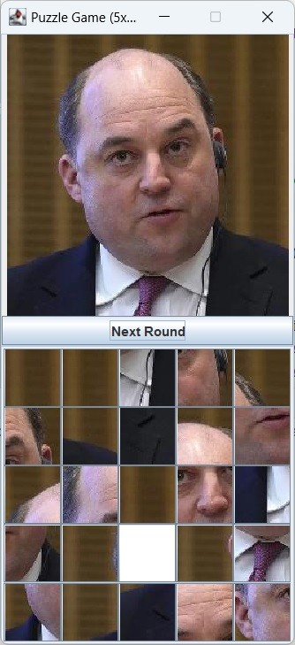

# Simple Puzzle Game based on Java Swing

This is a simple 5x5 puzzle game designed using the Java Swing framework that shows how to properly use various GUI library functions. You can only move the squares adjacent to the blank squares to complete the puzzle.

Due to the rough design of the form, it does not support dynamic image adjustment and cutting, so I wrote a console-based utility class SplitIntoGrids for compressing any image to 255x255, and compressing the image in horizontal and vertical 5 equal parts, forming 25 small squares, and finally taking the first square as a blank image, filling it with white.

***Having said that, I would like to emphasize that first perform the SplitIntoGrids operation on your custom image and then run the main program of the puzzle game.***

### Screenshot:

